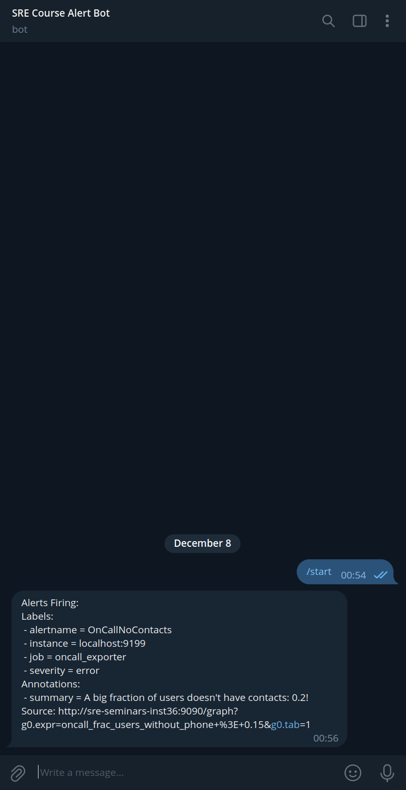

# ДЗ-10

## Как открыть страницу Prometheus

Для получения доступа к странице с Grafana требуется подключиться к виртуальной машине по ssh с пробрасыванием портов.

Пример:
```bash
ssh sre-course -L 3000:127.0.0.1:9090
```

Тогда на `localhost:9090` вы сможете увидеть работающий Prometheus. Данные для входа на нее находятся в файле `/home/ubuntu/grafana/grafana-access.txt`.

Для настройки файрвола была использована утилита ufw, [туториал](https://www.digitalocean.com/community/tutorials/ufw-essentials-common-firewall-rules-and-commands).

## Решение

1. Alertmanager был установлен по инструкции. Убедиться в этом можно если зайти в панель алертов: http://localhost:9090/alerts.
2. Были сформированы алерты. Получившийся конфиг нахохдится в `rules.yml`, он основан на ДЗ-4.
3. Была настроена отправка алертов в telegram.
   1. Был создан бот при помощи `@BotFather`: `@MrGeekmanSREAlertbot`. Сохранен токен.
   2. Был создан чат с ботом (личный). Сохранен id чата.
   3. Был исправлен `etc/alertmanager/alertmanager.yml`, чтобы работать с telegram. См. `alertmanager.yml`.
   4. Были созданы условия для алерта и было проверено, что он приходит в telegram.
   
