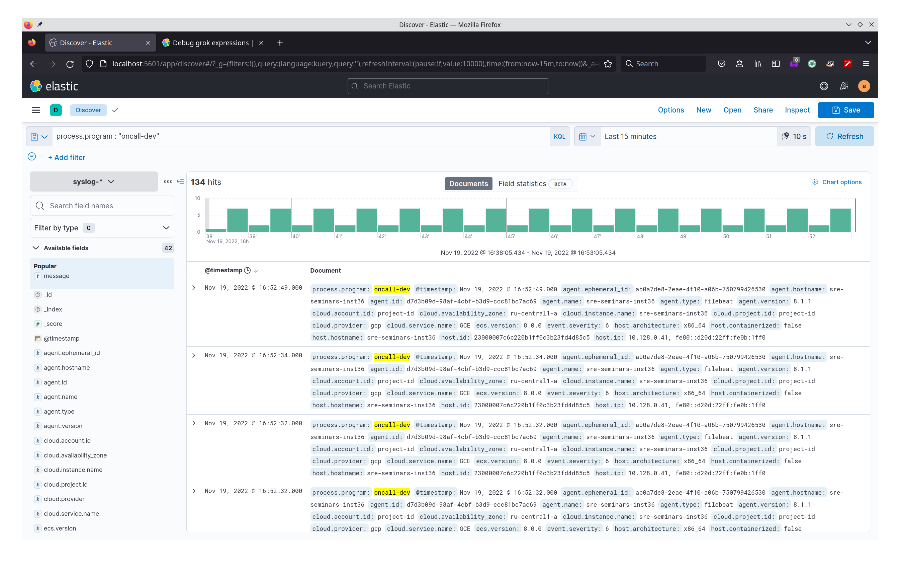
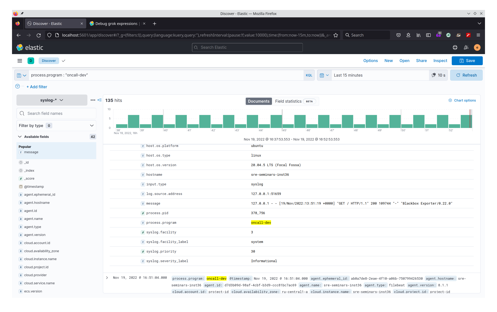

# ДЗ-6

## Как открыть страницу ElasticSearch

Для получения доступа к странице с Elasticsearch требуется подключиться к виртуальной машине по ssh с пробрасыванием портов.

Пример:
```bash
ssh sre-course -L 5601:127.0.0.1:5601
```

Тогда на `localhost:5601` вы сможете увидеть работающий Elasticsearch.

Для настройки файрвола была использована утилита ufw, [туториал](https://www.digitalocean.com/community/tutorials/ufw-essentials-common-firewall-rules-and-commands).

## Решение

1. Повторил инструкцию из `TASK.pdf`.
2. Добавил Ingested Pipeline `oncall-pipeline`, см. `oncall-pipeline.json`.
3. Проверил пайплайн в [Grok дебаггере](https://www.elastic.co/guide/en/kibana/8.5/xpack-grokdebugger.html) на строчке из oncall логов, см. `example.json`.
4. К сожалению, пока так и не понял как внедрить этот пайплан так, чтобы во вкладке Discover появились нужные поля.

При помощи запроса `process.program : "oncall-dev"` мы можем убедиться, что действительно выгрузили логи oncall:




