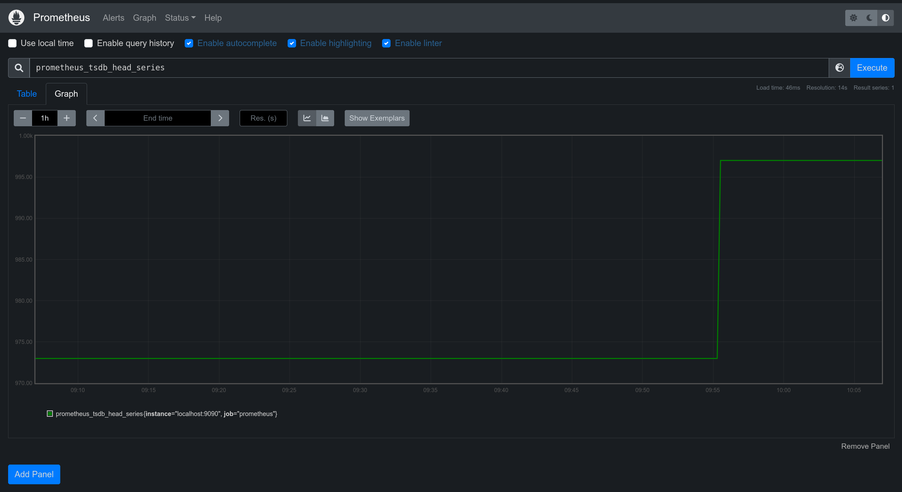

# ДЗ-7

## Как открыть страницу Grafana

Для получения доступа к странице с Grafana требуется подключиться к виртуальной машине по ssh с пробрасыванием портов.

Пример:
```bash
ssh sre-course -L 3000:127.0.0.1:3000
```

Тогда на `localhost:3000` вы сможете увидеть работающую Grafana. Данные для входа на нее находятся в файле `/home/ubuntu/grafana/grafana-access.txt`.

Для настройки файрвола была использована утилита ufw, [туториал](https://www.digitalocean.com/community/tutorials/ufw-essentials-common-firewall-rules-and-commands).

## Решение

1. Установил grafana при помощи deb-пакета по ссылке со [страницы](https://grafana.com/grafana/download?edition=oss&platform=linux).
2. Далее следовал инструкции из `TASK.pdf`.
3. Настроил конфиг `etc/grafana/grafana.ini`. Чтобы показать какие опции и в каких разделах надо было установить см. `config-sample.ini`.
4. Построил при помощи Prometheus график для `prometheus_tsdb_head_series`.

