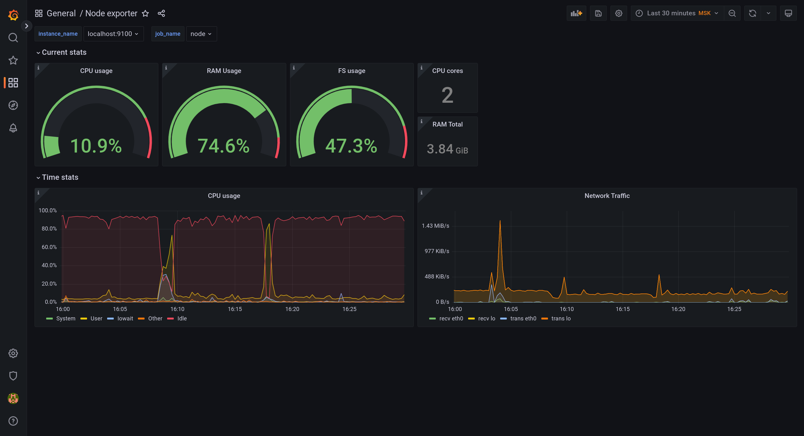
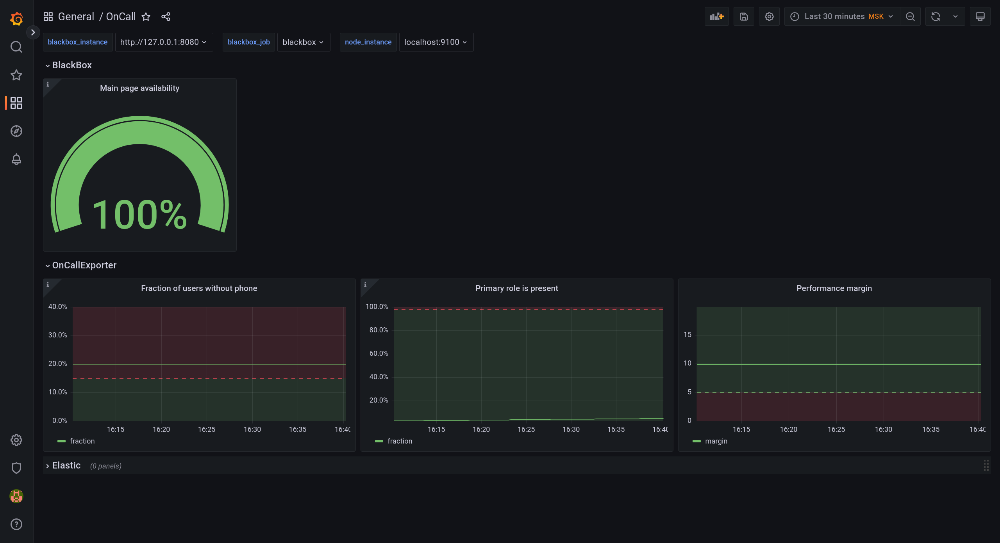

# ДЗ-8

## Как открыть страницу Grafana

Для получения доступа к странице с Grafana требуется подключиться к виртуальной машине по ssh с пробрасыванием портов.

Пример:
```bash
ssh sre-course -L 3000:127.0.0.1:3000
```

Тогда на `localhost:3000` вы сможете увидеть работающую Grafana. Данные для входа на нее находятся в файле `/home/ubuntu/grafana/grafana-access.txt`.

Для настройки файрвола была использована утилита ufw, [туториал](https://www.digitalocean.com/community/tutorials/ufw-essentials-common-firewall-rules-and-commands).

## Решение

1. См. дашборд Node Exporter. Пример изображения:

2. См. дашборд OnCall. Пример изображения:


Опишем, что происходит на втором изображении.
1. Доля доступности главной страницы согласно blackbox_exporter на данный момент за время заданного промежутка.
2. Доля пользователей без телефона в течение указанного времени.
3. Доля моментов, когда во всех команда есть primary дежурный за 1 день.
4. "Запас по производительности" из домашнего задания 4 за указанные промежтуки времени.

Что не получилось:
1. У меня не получилось подключить ElasticSearch к Grafana, я ловил ошибку Bad Gateway и не смог разобраться с проблемой.
